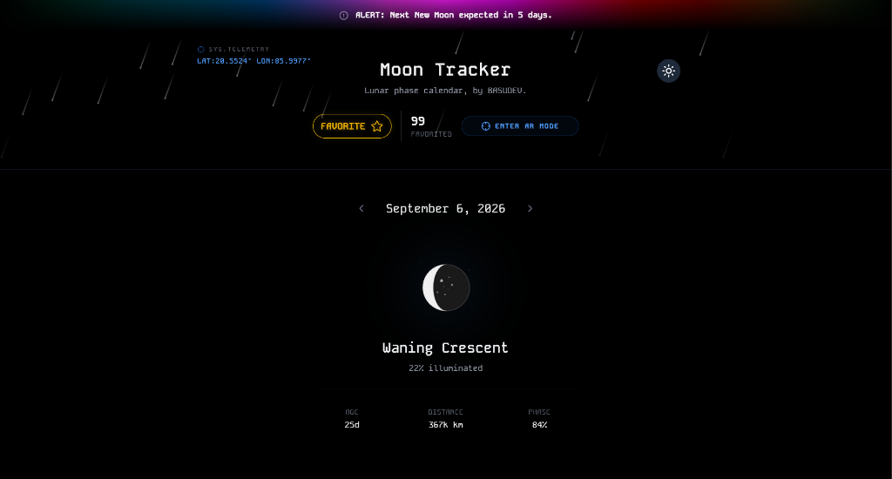
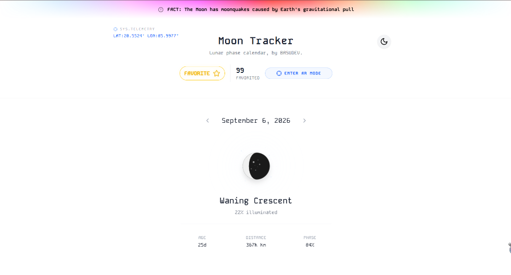
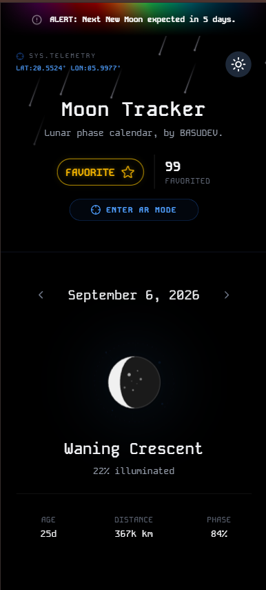
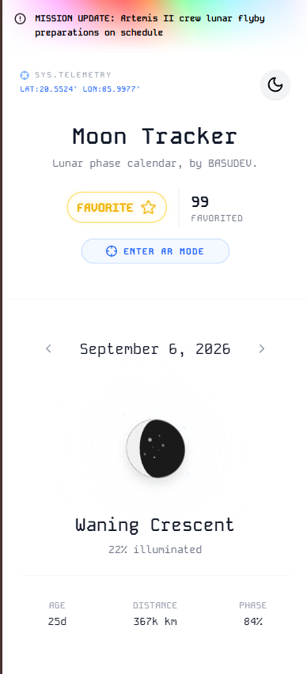
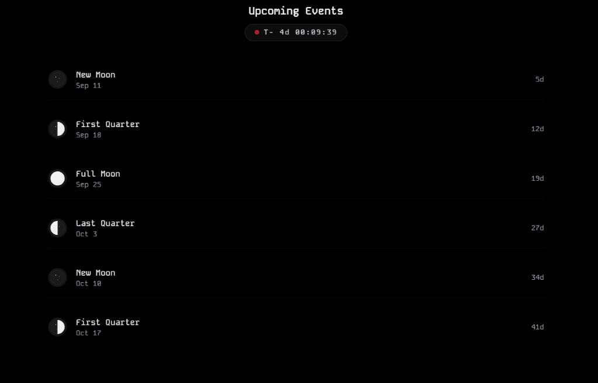
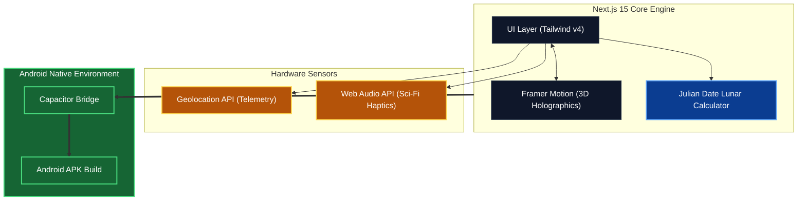

<div align="center">
  
  
  
  
  <br />
  <br />

  # 🌕 Moon Tracker
  **A Next-Generation Sci-Fi Lunar Phase Calendar & Celestial Telemetry Dashboard**
  
  <p>
    Experience the cosmos like never before. Moon Tracker is a high-tech, cinematic lunar calendar designed with a futuristic telemetry interface, 3D holographic elements, and precise astronomical calculations.
  </p>

  <p>
    Built with Next.js 15, Tailwind CSS, Framer Motion, and Capacitor for Android.
  </p>
</div>

---

## 📸 System Telemetry (Screenshots)

<div align="center">
  
  
</div>
<br />
<div align="center">
  
  
  
</div>

---

## 🚀 Futuristic Features

*   **🖲️ Holographic 3D Tilt**: The entire Moon visual operates as a 3D hologram. Move your mouse or tilt your device to watch the Moon and its glowing aura subtly shift perspective in real-time.
*   **🛰️ Live Telemetry Data**: Grants access to a futuristic `SYS.TELEMETRY` read-out, continuously tracking and displaying your exact real-world Latitude and Longitude coordinates with a pulsing radar blip.
*   **⏱️ Live "T-Minus" Countdown**: A sleek, pulsing digital countdown clock ticking down in real-time to the exact second of the next major celestial phase, inspired by NASA launch countdowns.
*   **📳 Haptic Feedback & Tech Sounds**: Engage with the interface to trigger soft vibrations (Android) and high-tech synthetic "holographic beep" audio feedback powered by the raw Web Audio API.
*   **🌌 Rotating Star Map**: A highly subtle, technical geometric star map that infinitely rotates behind the moon's glow, grounding the app in a realistic observatory feel.
*   **🌠 Dynamic Sci-Fi Backgrounds**:
    *   **Dark Mode**: Renders an atmospheric meteor shower (`<Meteors />`).
    *   **Light Mode**: Activates an animated, panning architectural grid (`<AnimatedGridPattern />`).
*   **💫 Cinematic Swipe Transitions**: Seamlessly navigate through time with fluid, physics-based framer-motion swipe animations.
*   **📡 Sync to Today**: An animated radar-sweep button that instantly realigns the dashboard telemetry to the current date.

---

## 🛠️ Project Structure & Folder Architecture

```text
lunar-Watch/
├── android/                 # Capacitor Android Project files & Gradle builds
├── app/                     # Next.js 15 App Router
│   ├── globals.css          # Global Tailwind styles & @theme animations
│   ├── layout.tsx           # Root layout, fonts, and sonner Toaster
│   └── page.tsx             # Main Telemetry Dashboard (The core UI)
├── components/
│   └── ui/                  # Reusable sci-fi UI components
│       ├── animated-grid-pattern.tsx # Light mode geometric grid
│       ├── meteors.tsx               # Dark mode meteor shower
│       ├── splash-screen.tsx         # Cinematic boot sequence
│       ├── star-button.tsx           # Golden glowing wishlist button
│       └── theme-wipe-toggle.tsx     # Theme switcher
├── public/                  # Static assets (3D Favicon, screenshots)
├── capacitor.config.ts      # Capacitor configuration bridging Web & Native
├── next.config.mjs          # Next.js configuration
├── package.json             # NPM dependencies & scripts
└── tailwind.config.ts       # Tailwind v4 configuration
```

### System Architecture Diagram



---

## ⚙️ Project Workflow

This project adheres to a strict and highly optimized **Atomic Commit Workflow**. 

1. **Local Web Development**: Run `npm run dev`. The Next.js 15 server boots up instantly, providing a live local environment for testing UI changes, Framer Motion physics, and Web Audio APIs.
2. **Component Engineering**: UI elements (like the T-Minus countdown or the 3D Holographic tilt) are built using React 19 hooks and Framer Motion's `useMotionValue`.
3. **Atomic Commits**: Every change to a file is immediately tracked, committed with a descriptive message, and pushed to the repository to maintain an immaculate version history.
4. **Android Compilation**: Using the command `npm run build:android`, the Next.js app is statically exported (`next build`), synchronized with Capacitor (`npx cap sync android`), and finally compiled into an APK (`./gradlew assembleDebug`).

---

## 📥 Installation & Build

### Web Version
```bash
# Install dependencies (use legacy-peer-deps for React 19 compatibility)
npm install --legacy-peer-deps

# Start the local telemetry server
npm run dev
```

### Android APK Build
```bash
# Build the Next.js app and sync to Capacitor
npm run build:android

# Generate the APK (Requires Android Studio / Gradle)
cd android
./gradlew assembleDebug
```
*The output APK will be available at: `android/app/build/outputs/apk/debug/app-debug.apk`*

---

## © Copyright & License

**Designed and Engineered by BASUDEV.**

© 2026 Basudev. All rights reserved.

This project and its futuristic UI concepts are the intellectual property of Basudev. Unauthorized reproduction or redistribution without explicit permission is strictly prohibited.
